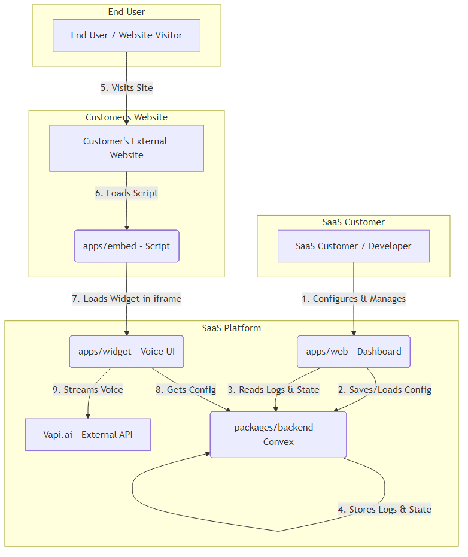
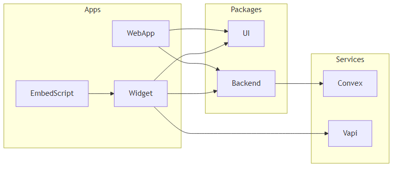
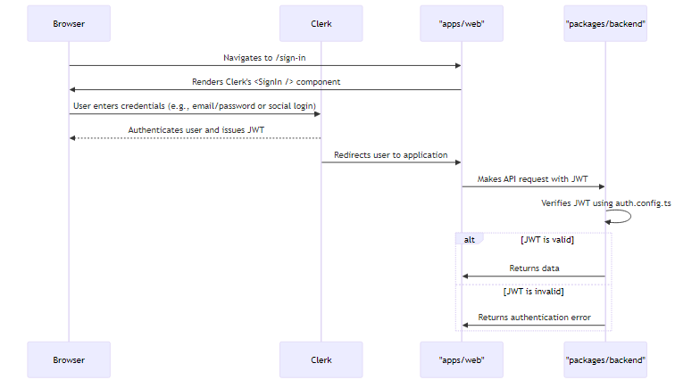
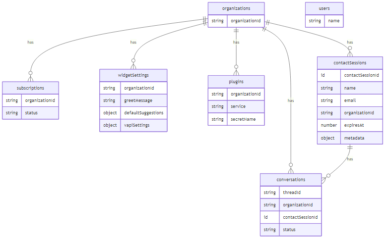
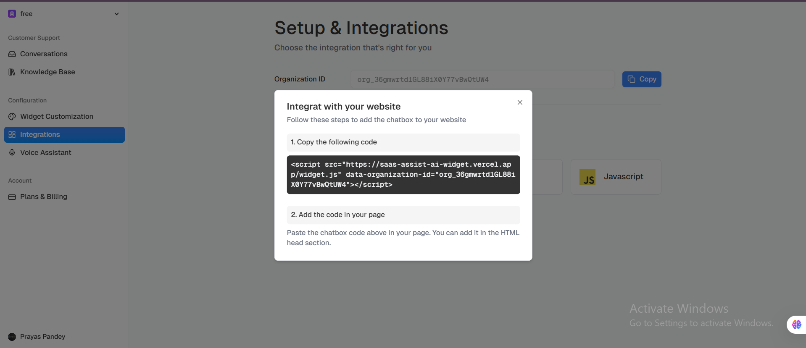

# SaaS Assist AI

<p align="center">
  <b>
    Open-source, production-grade boilerplate for building multi-tenant, voice-based AI assistants.
  </b>
</p>


---

### Built With

<p align="center">
  <a href="https://nextjs.org/" target="_blank" rel="noopener noreferrer">
    
  </a>
  <a href="https://react.dev/" target="_blank" rel="noopener noreferrer">
    
  </a>
  <a href="https://www.typescriptlang.org/" target="_blank" rel="noopener noreferrer">
    
  </a>
  <a href="https://tailwindcss.com/" target="_blank" rel="noopener noreferrer">
    
  </a>
  <a href="https://www.convex.dev/" target="_blank" rel="noopener noreferrer">
    
  </a>
  <a href="https://clerk.com/" target="_blank" rel="noopener noreferrer">
    
  </a>
  <a href="https://vapi.ai/" target="_blank" rel="noopener noreferrer">
    
  </a>
  <a href="https://aws.amazon.com/secrets-manager/" target="_blank" rel="noopener noreferrer">
    
  </a>
</p>

---

## Project Overview

Building a full-featured, multi-tenant SaaS application with a sophisticated AI layer is a complex undertaking. Developers face challenges in structuring the project, managing secure authentication, isolating tenant data, and integrating third-party AI services in a scalable way.

**SaaS Assist AI** is a comprehensive boilerplate that solves these problems. It provides a robust, production-ready foundation for creating voice-enabled AI assistants that can be embedded into any website. The project is designed for developers and businesses who want to accelerate the development of their own AI-powered SaaS products.

**Real-world use cases:**
- **Automated Customer Support:** Embed a voice assistant on a website to answer common questions.
- **Interactive Product Tours:** Guide users through a product with an interactive voice agent.
- **AI-Powered Data Entry:** Fill out forms and capture information through a voice conversation.

---

## 🔴 Video Demo

Watch the complete walkthrough and live demonstration of **SaaS Assist AI**, including the dashboard, voice assistant interaction, and system architecture overview.

👉 <a href="https://youtu.be/2r0u9rDGtgA" target="_blank" rel="noopener noreferrer">
  Watch Demo on YouTube
</a>

---

## 🌐 Live Demo

Experience the application in action through the hosted demo.  
You can interact with the voice-enabled AI assistant and explore the core SaaS functionality.

👉 <a href="https://saas-assist-ai-web.vercel.app/conversations" target="_blank" rel="noopener noreferrer">
  Open Live Demo
</a>

---

## Key Features

- **Voice-Based AI Assistant:** Real-time, low-latency voice conversations powered by Vapi.ai.
- **Multi-Tenant Architecture:** Securely manage multiple organizations with data isolation at the database level.
- **Embeddable Widget:** A lightweight, embeddable widget that can be integrated into any third-party website with a single script tag.
- **SaaS Admin Dashboard:** A comprehensive dashboard (built with Next.js and Shadcn UI) for organizations to manage their settings, view conversations, and configure their assistants.
- **Plugin System for AI Services:** A flexible backend structure designed to securely manage API keys (using AWS Secrets Manager) and connect to various AI services.
- **Secure Authentication:** User and organization management handled by Clerk.
- **Scalable Backend:** Serverless functions and database provided by Convex, ensuring the backend scales automatically with demand.
- **Monorepo Structure:** A clean, maintainable codebase organized as a Turborepo monorepo with separate apps and shared packages.

---

## System Architecture

This project uses a **monorepo architecture** powered by pnpm and Turborepo to manage dependencies and streamline development across multiple applications and shared packages.

- **Frontend (`apps/web`):** A Next.js application that serves as the main dashboard for SaaS customers. Here, users can sign up, manage their organization, configure their AI assistant, and view conversation logs.
- **AI Widget (`apps/widget`):** A separate, lightweight Next.js application that renders the voice assistant widget. It is designed to be embedded in an iframe on a customer's website.
- **Embed Script (`apps/embed`):** A simple TypeScript script that customers place on their website. This script dynamically injects the `apps/widget` iframe and passes the necessary organization-specific configuration.
- **Backend (`packages/backend`):** The core business logic, database schema, and serverless functions, all built on Convex. It handles data storage, AI logic orchestration, and communication with third-party services like Vapi.ai.
- **UI Library (`packages/ui`):** A shared package containing UI components used across the `web` and `widget` applications.

### Data Flow

1.  A SaaS customer signs up and configures their assistant via the **Web Dashboard**.
2.  Configuration is saved to the **Convex Backend**.
3.  An end-user visits the customer's website, which loads the **Embed Script**.
4.  The script injects the **AI Widget** in an iframe, passing the `organizationId`.
5.  The AI Widget fetches its configuration from the **Convex Backend** and initiates a voice session with **Vapi.ai**.
6.  Conversation data is logged back to the **Convex Backend**.

### System Diagrams

| Diagram                 | Description                                                                                                                                                                                                                                                                                       |
| ----------------------- | ------------------------------------------------------------------------------------------------------------------------------------------------------------------------------------------------------------------------------------------------------------------------------------------------- |
| **High-Level Architecture** | This diagram provides a high-level overview of the entire system, showing the relationships between the frontend applications (web, widget, embed), the backend (Convex), and third-party services (Clerk, Vapi, AWS). <br><br>                              |
| **Component Diagram**       | This diagram offers a more detailed view of the frontend and backend components, illustrating how they interact. It shows the different modules within the Next.js applications and the serverless functions in the Convex backend. <br><br>        |
| **Authentication Flow**   | This diagram illustrates the authentication process, showing how users and organizations are authenticated using Clerk and how the session is managed between the frontend and backend. <br><br>  |
| **Database Schema**       | This diagram visualizes the database schema, showing the different tables, their columns, and the relationships between them. This helps developers understand how data is organized and stored in the Convex database. <br><br>              |

---

## Tech Stack

- **Frontend:** Next.js, React, TypeScript, Tailwind CSS, Shadcn UI
- **Backend:** Convex
- **AI / LLM / Agents:** Vapi.ai, Google AI (via `@ai-sdk/google`)
- **Database:** Convex Database
- **Authentication:** Clerk
- **DevOps & Tooling:** pnpm, Turborepo, ESLint, TypeScript
- **Cloud Services:** AWS Secrets Manager (for storing customer API keys)

---

## AI & Intelligence Layer

The intelligence of this platform is primarily driven by its integration with **Vapi.ai**, a service for building real-time voice AI assistants.

- **Voice Interaction:** The `apps/widget` application uses the `@vapi-ai/web` SDK to handle the entire voice interaction lifecycle, including capturing audio, sending it to the Vapi service, and playing back the AI's response.
- **Agent Orchestration:** The Convex backend is designed to support different AI "agents" or "plugins." The `plugins` table in the database schema stores credentials for various services (e.g., Vapi), which are securely managed via AWS Secrets Manager. This allows each organization to potentially use its own set of AI tools in the future.
- **Assistive Logic:** The "assistive" nature comes from the AI's ability to be configured with specific knowledge and tools, allowing it to perform tasks on behalf of the user or the business, such as answering questions based on provided data or escalating issues when it cannot resolve them.

---

## Installation & Setup

### Prerequisites

- Node.js (>=20.0.0)
- pnpm (>=10.0.0)
- A Convex account
- A Clerk account
- A Vapi.ai account
- An AWS account with permissions for Secrets Manager

### Environment Variables

You will need to create a `.env` file in `packages/backend`. Use the following template and fill in your credentials.

```sh
# .env example for packages/backend

# Convex
CONVEX_SITE=
CONVEX_DEPLOYMENT=

# Clerk (for Convex backend)
CLERK_JWT_ISSUER_DOMAIN=

# AWS (for managing customer secrets)
AWS_ACCESS_KEY_ID=
AWS_SECRET_ACCESS_KEY=
AWS_REGION=

# Vapi (Example of a secret you might store for a customer)
# This is illustrative; actual keys are managed via the backend logic.
VAPI_API_KEY=
```

You will also need to create a `.env.local` file in `apps/web`.

```sh
# .env.local example for apps/web

# Clerk (for Next.js frontend)
NEXT_PUBLIC_CLERK_PUBLISHABLE_KEY=
CLERK_SECRET_KEY=

# Convex URL (from your Convex dashboard)
NEXT_PUBLIC_CONVEX_URL=
```

### Step-by-Step Setup

1.  **Clone the repository:**
    ```sh
    git clone <repository-url>
    cd saas-assist-ai
    ```

2.  **Install dependencies:**
    ```sh
    pnpm install
    ```

3.  **Set up Convex backend:**
    - Log in to your Convex account: `npx convex login`
    - Deploy the backend: `npx convex deploy`
    - Push the database schema: `npx convex dev` (run this in a separate terminal)

4.  **Run the applications:**
    ```sh
    pnpm dev
    ```
    This will start the `apps/web` dashboard and other packages in development mode.

---

## Usage Guide

1.  Navigate to the `apps/web` URL (typically `http://localhost:3000`).
2.  Sign up for a new account, which will also create a new organization.
3.  From the dashboard, navigate to the "Customization" or "Settings" page.
4.  Configure the assistant's greeting message and other settings.
5.  Go to the "Integrations" page to get the embed script for your organization.
6.  Paste the script into an HTML file or another website to see the assistant widget in action.

---

## Learning Outcomes & Engineering Highlights

- **Production-Grade Monorepo:** Learn how to structure a complex application using Turborepo for efficient development.
- **Multi-Tenant SaaS Architecture:** Understand how to build a SaaS application from the ground up, with clear data separation between tenants using a simple `organizationId`.
- **Secure Secret Management:** See a production-ready pattern for managing customer-specific API keys using AWS Secrets Manager, which is critical for any AI SaaS platform that integrates with third-party services.
- **Decoupled AI Layer:** The architecture cleanly separates the core application from the AI services, making it easy to swap out or add new AI providers in the future.
- **Serverless-First Mindset:** The use of Convex demonstrates how to build a highly scalable, low-maintenance application with a serverless backend.

---

## Scalability & Future Improvements

- **Scalability:** The architecture is highly scalable. Convex handles backend and database scaling automatically. The frontend applications are stateless and can be deployed to serverless platforms like Vercel.
- **Future Improvements:**
  - **Advanced Plugin System:** Expand the backend to support more AI services beyond Vapi.
  - **Role-Based Access Control (RBAC):** Implement roles (e.g., admin, agent) within each organization.
  - **Billing Integration:** Add a billing page and integrate with Stripe to manage subscriptions.
  - **More Sophisticated AI Agents:** Implement more complex AI workflows using tools like LangChain or by building custom agents within the Convex backend.

---

## Gallery

### Images




---

## Contribution & Development Notes

- **Folder Conventions:** Feature-related code is often co-located. For example, authentication UI and logic are found in `modules/auth`.
- **Shared Code:** Reusable components and hooks should be placed in the `packages/ui` directory.
- **Backend Logic:** All backend functions and schema definitions are located in `packages/backend/convex`.

---

## License & Disclaimer

This project is licensed under the MIT License. It is intended for educational purposes and as a boilerplate for building your own applications. It is not a fully-featured, production-ready product out of the box.
